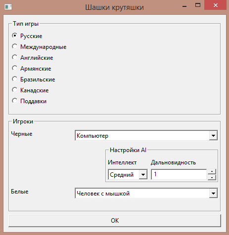
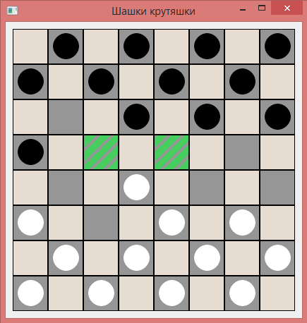
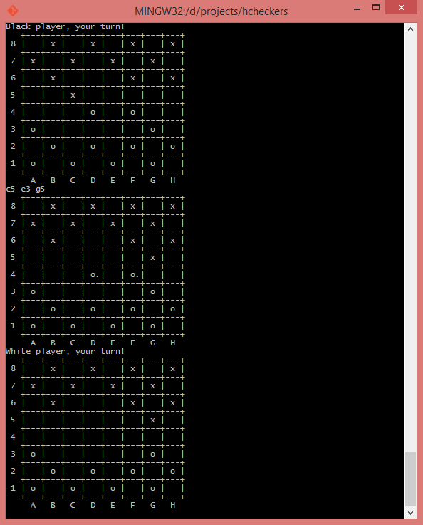

# checkers

[](https://travis-ci.org/cmc-haskell-2015/checkers)

Игра «Шашки».

## Сборка и установка

Проект поддерживает два front-end'а:
* На базе wxWidgets -- основной
* Консольный -- для тестирования

Такие хитрости нужны для того, чтобы можно было тестироватсья и запускаться без
установленных wxWidgets + wxHaskell (которые весьма нетривиальны в установке и
конфигурировании для неподготовленных людей, особенно под Windows).

Выбор используемого front-end'а происходин на этапе конфигурирования.

Для сборки и запуска консольной версии достаточно склонировать репозиторий и
запустить `cabal run`

```
$ git clone https://github.com/cmc-haskell-2015/checkers.git
$ cd checkers
$ cabal run
```

Версия с wxWidgets требует дополнительно конфигурации с флагом `usewx` перед запуском

```
$ git clone https://github.com/cmc-haskell-2015/checkers.git
$ cd checkers
$ cabal configure -f usewx
$ cabal run
```

## Скриншоты



Менюшка с настройками запуска игры



Игра в интерфейсе wx-widgets



Игра в тёплом ламповом интерфейсе

## Документация

Автоматическая документация кода сгенерирована при помощи [Haddock](https://www.haskell.org/haddock/).

Онлайн документация доступна здесь: http://cmc-haskell-2015.github.io/checkers/docs/

Локально документацию можно собрать, запустив простую команду:

```
$ cabal haddock
```
